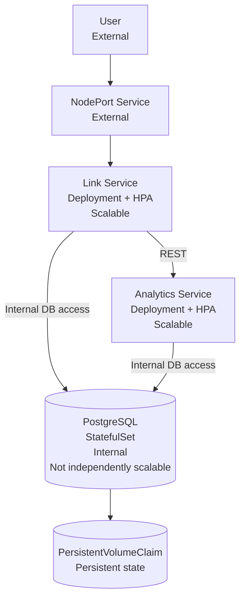

# ScaleLink Architecture

## Architecture diagram

## Labels

- **External** - reachable from outside Kubernetes.
- **Internal** - reachable only inside Kubernetes.
- **REST** - HTTP communication between microservices.
- **Persistent state** - data survives pod recreation.
- **Scalable** - supports multiple horizontal replicas.
- **Not independently scalable** - PostgreSQL remains one StatefulSet replica in this deployment.

## Components and responsibilities

### Link Service

The Link Service is the external user-facing microservice.

Responsibilities:
- browser interface;
- create, retrieve and delete short links;
- resolve short codes and return HTTP 307 redirects;
- store link data in PostgreSQL;
- call Analytics through REST;
- expose /health and /ready.

It runs as a Deployment with an HPA and scales independently.

### Analytics Service

The Analytics Service is internal-only.

Responsibilities:
- receive click events from Link through REST;
- store analytics events in PostgreSQL;
- expose /health and /ready.

It has its own Deployment and HPA and scales independently from Link.

### PostgreSQL

PostgreSQL stores links and analytics events.
It is internal-only and is deployed as a StatefulSet.
It is not independently horizontally scalable in this coursework deployment.

### PersistentVolumeClaim

The PVC stores PostgreSQL data so records survive pod deletion and recreation.

### NodePort Service

The NodePort Service is the external entry point from the user to the Link Service.

## Component-to-microservice mapping

| Component | Kubernetes resource | Role | Scaling |
| --- | --- | --- | --- |
| Link | Deployment + HPA | UI, links, redirects | Independently scalable |
| Analytics | Deployment + HPA | Click-event processing | Independently scalable |
| PostgreSQL | StatefulSet | Persistent database | Not independently scalable |
| PVC | PersistentVolumeClaim | Durable database storage | N/A |
| External entry | NodePort Service | Browser access | N/A |
| Configuration | ConfigMap | Non-sensitive configuration | N/A |
| Secrets | Kubernetes Secret | Sensitive runtime values | N/A |

## Architecture principles

1. **Separation of concerns** - Link and Analytics have separate responsibilities.
2. **Independent scalability** - Link and Analytics scale independently.
3. **Stateless application services** - durable state is stored in PostgreSQL.
4. **Persistent-state separation** - PostgreSQL uses a PVC.
5. **Kubernetes service discovery** - services use stable DNS names rather than pod IPs.
6. **Graceful degradation** - Analytics failure does not prevent redirects.
7. **Minimal public exposure** - only Link is externally accessible.
8. **Health-aware orchestration** - Link and Analytics use liveness/readiness probes.
9. **Automatic recovery** - Deployments recreate deleted application pods.
10. **Resource boundaries** - CPU and memory requests/limits are defined.

## Request flow

Short-link creation:

User -> NodePort -> Link -> PostgreSQL

Redirect and analytics:

User -> NodePort -> Link -> PostgreSQL

Link -> REST -> Analytics -> PostgreSQL

Analytics is not required for redirect availability.

## Architecture summary

ScaleLink has one external entry point, two independently scalable application microservices, an internal persistent PostgreSQL database and a PVC for durable state.
